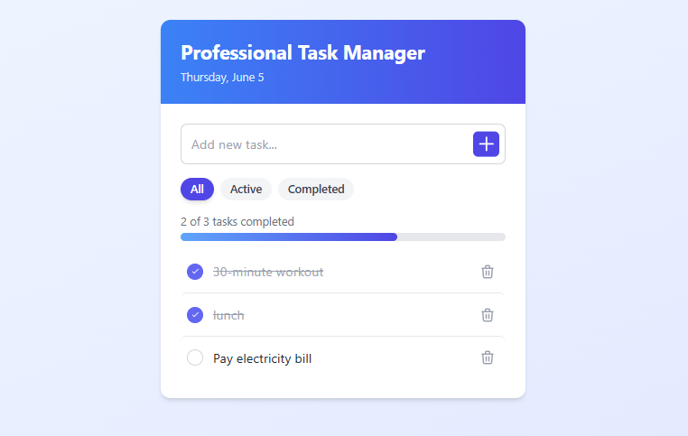

# Professional Task Manager  

 

A modern task management app built with **React + TypeScript + Tailwind CSS**, featuring localStorage persistence for your tasks.  

## ✨ Features  

- **Add, edit, and delete tasks**  
- **Mark tasks as complete/incomplete** ✅  
- **Filter tasks** (All/Active/Completed) 🔍  
- **Progress tracking** with visual percentage bar 📊  
- **Responsive design** (works on mobile & desktop) 📱  
- **Auto-saves** tasks using `localStorage` 💾  

## 🚀 Quick Start  

### Prerequisites  
- Node.js (≥ v14)  
- npm (≥ v6)  

### Installation  
1. Clone the repo:  
```bash
git clone https://github.com/yonasleykun27/frontend.git
cd frontend
```  

2. Install dependencies:  
```bash
npm install
```  

3. Start the development server:  
```bash
npm start
```  

4. Open in browser:  
👉 `http://localhost:3000`  

## 🛠 Tech Stack  

| Technology       | Purpose                          |
|------------------|----------------------------------|
| **React**        | UI Components                    |
| **TypeScript**   | Type Safety                      |
| **Tailwind CSS** | Styling                          |
| **Vite**         | Fast Build Tool                  |  

## 📂 Project Structure  

```
src/
├── components/      # Reusable components
│   ├── AddTask.tsx  # Task creation form
│   └── TaskItem.tsx # Single task UI
├── App.tsx          # Main application logic
├── main.tsx         # App entry point
└── (styles)         # Tailwind CSS
```  

## 🤝 How to Contribute  

1. **Fork** the repository  
2. **Create a branch**:  
```bash
git checkout -b feature/your-feature
```  
3. **Commit changes**:  
```bash
git commit -m "Add your feature"
```  
4. **Push** to your fork:  
```bash
git push origin feature/your-feature
```  
5. Open a **Pull Request**  

## 📜 License  
MIT © [Yonas Leykun](https://github.com/yonasleykun27)  

## 📬 Contact  
📧 **Email**: yonasleykun27@gmail.com  
🔗 **GitHub**: [@yonasleykun27](https://github.com/yonasleykun27)  
